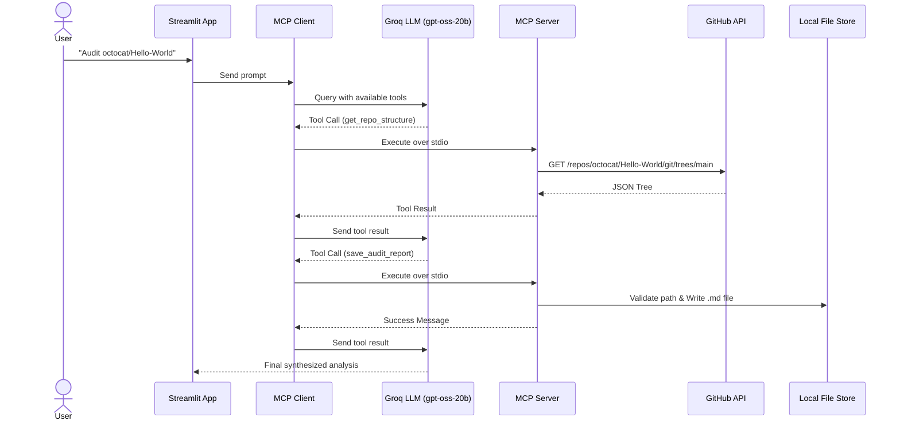

```markdown
# 🔍 MCP Open-Source Auditor

An AI-powered open-source codebase auditor built using the [Model Context Protocol (MCP)](https://modelcontextprotocol.io/). It autonomously navigates public GitHub repositories, reads codebase structures, analyzes issues, and securely writes markdown audit reports to a local file store.

 *(Note: Add a screen recording or screenshot of your Streamlit UI here)*

---

## 🛡️ Assessment Criteria & Security

This project was built to demonstrate production-grade MCP implementation, focusing heavily on safety and state management.

- **Genuine Side Effects:** Features a local File Store capability (`save_audit_report`) allowing the AI to persist its findings to disk.
- **Typed Inputs:** All MCP tools utilize strict Pydantic `Field` models to enforce schema validation before execution.
- **State Protection & Refusal Boundaries:** The server implements strict path-traversal protection (`is_relative_to`) and extension allowlisting. It explicitly **refuses** attempts to write non-markdown files or write outside the sandboxed `audit_reports/` directory, guaranteeing the host system cannot be corrupted by malformed AI arguments.
- **Resilient Transport:** Utilizes standard I/O (`stdio`) with stream sanitization to ensure pure JSON-RPC communication between the client and server.

---

## 🏗 Architecture

The application bridges a Streamlit frontend with a local MCP server, using Groq's high-speed open-weight models for tool orchestration.



---

## 🧰 Available MCP Tools

1. `get_repo_structure`: Fetches the complete file tree of a GitHub repository.
2. `read_file_content`: Reads and decodes raw content of specific files (handles base64).
3. `get_issue_details`: Retrieves and summarizes recent repository issues and labels.
4. `save_audit_report`: **[Side Effect]** Safely writes the LLM's findings to a sandboxed local markdown file.

---

## 🚀 Setup & Installation

### 1. Prerequisites

* Python 3.10+
* A [Groq API Key](https://console.groq.com/keys) (Free tier supported)
* A [GitHub Personal Access Token](https://github.com/settings/tokens) (Optional, but highly recommended to avoid GitHub's 60 req/hr rate limit)

### 2. Clone and Initialize

```bash
git clone [https://github.com/yourusername/mcp-github-auditor.git](https://github.com/yourusername/mcp-github-auditor.git)
cd mcp-github-auditor

# Create a virtual environment
python -m venv venv

# Activate the environment
# On Windows:
venv\Scripts\activate
# On Mac/Linux:
source venv/bin/activate

# Install dependencies
pip install -r requirements.txt

```

### 3. Environment Configuration

Copy the environment template and insert your API keys:

```bash
cp .env.example .env

```

Open `.env` and fill in your `GROQ_API_KEY` and `GITHUB_TOKEN`.

---

## 💻 Running the Application

Launch the interactive Streamlit UI:

```bash
streamlit run app.py

```

**Example Prompts to Try:**

* *"Analyze the structure of octocat/Hello-World and save an audit report."*
* *"What are the most recent open issues in [Any/Repo]?"*
* **(Test the Refusal Boundary):** *"Write an audit report but save it as a .py file."* or *"Save the report to ../../test.md"*

---

## 🧪 Testing

The project includes a `pytest` suite that mocks the GitHub API to ensure robust error handling and schema parsing without hitting rate limits.

```bash
pytest tests/

```

```

```